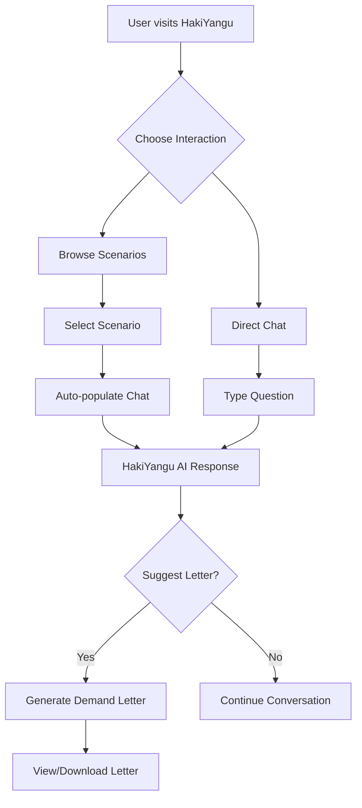
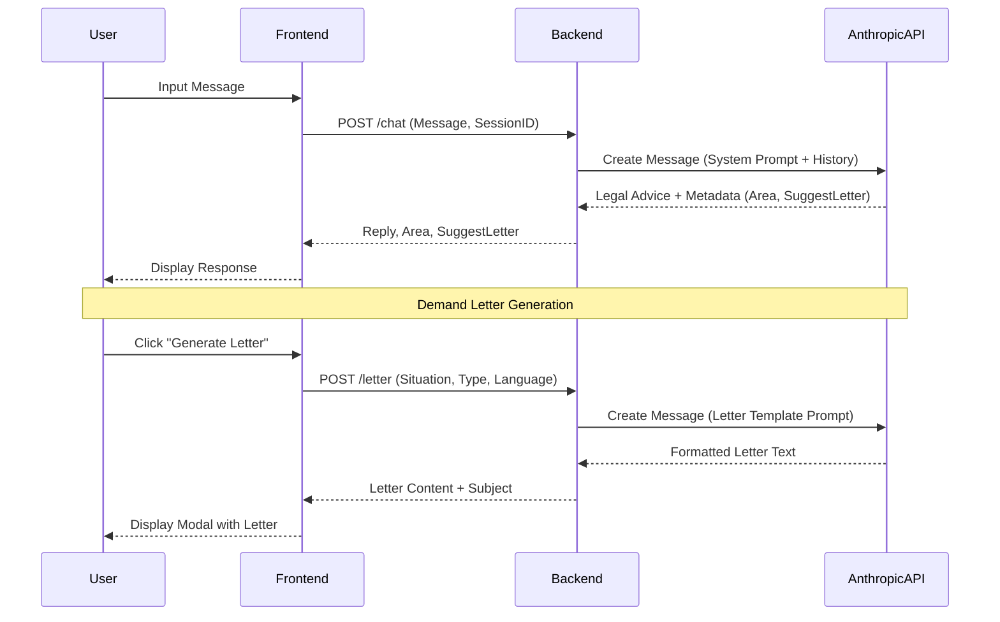

# HakiYangu 🇰🇪

HakiYangu (Swahili for "My Rights") is an AI-powered legal rights assistant designed to make Kenyan law accessible, understandable, and actionable for every citizen.

## 🌟 Overview

Navigating the legal landscape in Kenya can be daunting. HakiYangu bridges the gap by providing:
- **Bilingual Support:** Interaction in both English and Swahili (Sheng-friendly).
- **AI Legal Guidance:** Instant, plain-language explanations of rights under Kenyan Acts.
- **Demand Letter Generation:** Automated creation of formal demand letters and complaints.
- **Pre-defined Scenarios:** Quick access to common legal issues (Landlord/Tenant, Employment, etc.).

---

## 🏗️ Architecture

The project is split into two main parts:
1.  **Frontend:** Next.js application with a focus on immersive, interactive UI.
2.  **Backend:** NestJS API providing logic for AI chat, letter generation, and scenario management.

### System Interaction Flow



### Technical Data Flow



---

## 🛠️ Tech Stack

### Frontend
- **Framework:** Next.js 15 (App Router)
- **Styling:** Tailwind CSS + Vanilla CSS (for custom animations)
- **UI Components:** Radix UI / Shadcn UI
- **Animations:** Framer Motion, AOS (Animate On Scroll)
- **Icons:** Lucide React

### Backend
- **Framework:** NestJS
- **Language:** TypeScript
- **AI Engine:** Anthropic Claude 3.5 Sonnet
- **Configuration:** Nest ConfigService

---

## 🚀 Getting Started

### Prerequisites
- Node.js (v18+)
- npm or yarn
- Anthropic API Key

### Installation

1.  **Clone the repository:**
    ```bash
    git clone https://github.com/your-username/hakiyangu.git
    cd hakiyangu
    ```

2.  **Setup Backend:**
    ```bash
    cd backend
    npm install
    cp .env.example .env # Add your ANTHROPIC_API_KEY
    npm run start:dev
    ```

3.  **Setup Frontend:**
    ```bash
    cd ../frontend
    npm install
    npm run dev
    ```

---

## ⚖️ Disclaimer

HakiYangu is an informational tool and **does not provide legal advice**. It is designed to help users understand their rights and prepare for legal actions. Always consult with a registered advocate for complex legal matters.

---

## 👥 The Team

- **Martha Ngendo** - Product Lead
- **Eddy Max Kilonzo** - Software Engineer
- **John Brandews** - Full-Stack Developer
- **Felix Tony Maloba** - UI/UX Designer

---

Built with ❤️ for Kenya 🇰🇪
